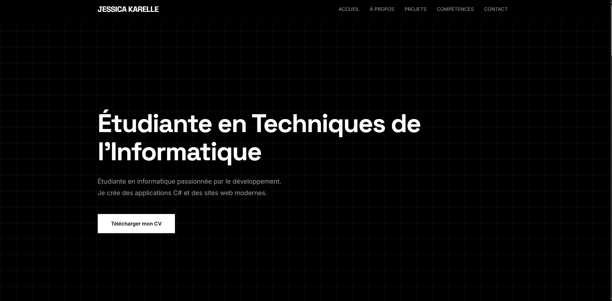

<p align="center">
  
</p>

# Portfolio Website

Personal portfolio website of Jessica Karelle, computer science student.  
Showcasing web site, C# projects.

## Features

- Responsive design
- Project modals with details
- Smooth scrolling navigation
- Contact section

## Technologies

- HTML5, CSS3, JavaScript
- Bootstrap 5
- Font Awesome, Google Fonts

## Tools

- Git
- Visual Studio Code
- Phcode.dev

## Getting Started

```bash
git clone https://github.com/jessicakarelle/portfolio-website.git
cd portfolio-website
start index.html
```

Open `index.html` in your browser or just search for "portfolio.jessicakarelle.com".

## Credits

Developed by [Jessica Karelle](https://github.com/jessicakarelle)

## License

Personal Project
